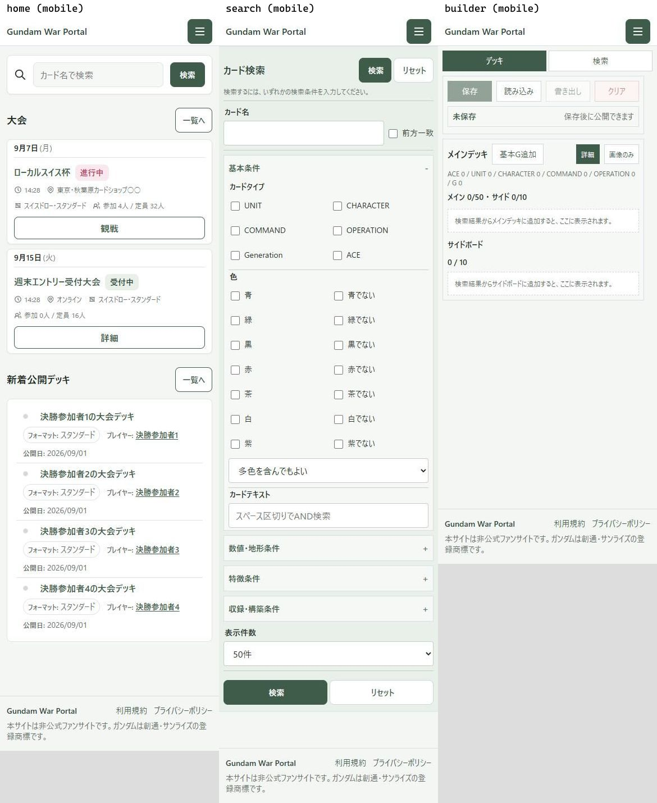
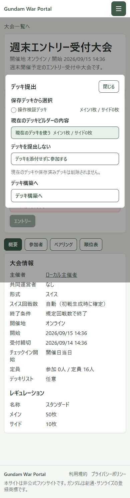
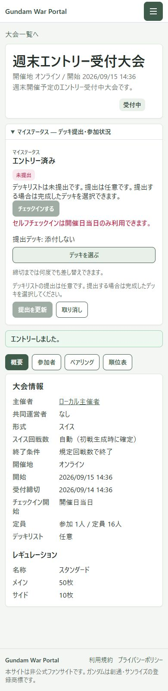
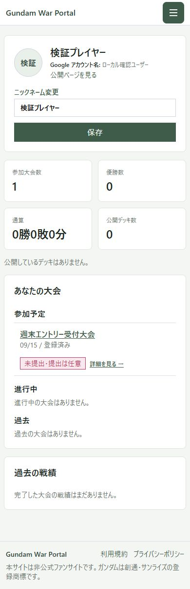

# 全ページの使いやすさ検証と改善

2026年9月8日。トップ以外も含め、18画面・状態を実際に表示し、一般ユーザーの検索→デッキ保存→大会参加を操作して検証しました。必要な改善はコードへ反映済みです。本番への書き込み・公開・デプロイは行っていません。

[PC／スマホの改善前・改善後を画像で比較する](index.html)

## 結論

主要な導線は利用できます。実操作で見つかった「任意提出大会なのに作成中の未完成デッキが参加を妨げる」「管理画面の内容が狭い列に押し込まれる」「ニックネーム登録からキーボードのフォーカスが背後へ抜ける」を修正しました。スマホの検索入力・メニュー・見出し・順位表も整理しました。

Product Design の監査手順に沿い、現在の画面を撮影・目視確認してから改善し、同じ条件で撮り直しています。生成したイメージ図ではなく、実装された画面の記録です。

## 利用者としての検証手順

1. **ホームから探す — 良好、余白と操作領域を改善。** 検索・公開デッキ・大会への入口を確認。「一覧へ」はスマホでも見出し横へまとめ、メニューの操作領域を36pxから44pxへ拡大しました。
2. **カードを検索する — 良好、入力しやすさを改善。** 「ガンダム」で実カード722件を取得し、検索に戻って条件が保持されることを確認。スマホの主入力欄を25pxから44pxへ、文字を16pxへ拡大。カードタイプを2列、ラベルを左揃えにしました。
3. **デッキを作り保存する — 検証成功。** 実カードの検索→メインへ追加→保存→再読み込み、基本Gの追加を実施。枚数と保存内容の保持を確認しました。ニックネーム登録では初期フォーカス、Tab／Shift+Tab、背後へのフォーカス移動を改善し、必須登録の制約は維持しています。
4. **公開デッキを探して使う — 検証成功、見出しを改善。** プレイヤー「決勝参加者1」で絞り込み、詳細を開き、50枚をデッキ構築へコピーできました。公開デッキ一覧・詳細のスマホ見出しを明確化しています。
5. **大会を見て参加する — 問題を修正して検証成功。** 受付中・進行中・完了状態を確認。未完成デッキを消さずに「デッキを添付せずに参加する」を選べるようにし、エントリー成功→参加者一覧→マイページ反映を確認。元の作成中デッキも残ります。必須提出大会、選択済み未完成デッキ、ロック状態の制約は維持しました。任意大会の参加後は提出を強制する案内と未選択時の枚数不足警告を抑えています。
6. **対戦・順位・プロフィールを読む — 良好、順位表を改善。** 完了大会の参加者・ペアリング・順位表・リザルトの切り替え、公開プロフィール、掲示用画面を確認。スマホの順位カードを「順位＋名前／勝・負・分／得点＋OMW」の3行へ整理し、運営側にも適用しました。
7. **主催者・管理者の画面を使う — 表示を確認、管理画面を改善。** 別のローカル検証ロールで大会作成・運営画面を確認。権限管理はPCでユーザー情報・権限・リセットを分離し、スマホでは全幅カードに変更。入力・選択・リセットの操作領域も拡大しました。一般ユーザーの管理画面アクセス拒否を実操作で確認。実大会の作成や実ユーザーの権限変更はしていません。
8. **規約・プライバシー・404を読む — 表示は良好、運営判断が残る。** 本文の折り返しと見出し、未ログイン時のアクセス、404からの復帰リンクを確認。削除依頼窓口は画面上で「準備中」のため、公開運営時に窓口の確定が必要です。法的な妥当性は今回評価していません。

### 大会参加の実画面

## 画面別の確認範囲

各行の改善前・改善後は [画像比較ページ](index.html) にPC・スマホ両方を保存しています。「確認」は表示・導線の範囲であり、すべての分岐や本番処理の保証ではありません。

| 番号 | 画面・状態 | 結果 |
| --- | --- | --- |
| 01 | ホーム | 見出しと一覧リンク、操作領域を改善 |
| 02 | カード検索 | 入力・ラベル・カードタイプの配置を改善、条件保持を確認 |
| 03 | デッキ構築 | 検索、追加、保存、再読み込みを確認 |
| 04 | 公開デッキ一覧 | 見出し改善、プレイヤー絞り込みを確認 |
| 05 | 公開デッキ詳細 | 見出し改善、構築画面へのコピーを確認 |
| 06 | 大会一覧 | 状態別の表示と詳細への入口を確認 |
| 07 | 受付中大会 | デッキなし参加と任意提出の案内を改善 |
| 08 | 進行中大会 | 大会情報、参加状況、対戦情報を確認 |
| 09 | 完了大会 | タブ切り替えを確認、順位カードを改善 |
| 10 | 掲示用表示 | PC・スマホの表示を確認 |
| 11 | マイページ | 登録、参加大会反映を確認、任意提出表示を改善 |
| 12 | 公開プロフィール | 戦績・公開デッキ・大会へのリンクを確認 |
| 13 | 利用規約 | 本文の読みやすさとアクセスを確認 |
| 14 | プライバシーポリシー | 表示確認。削除依頼窓口の確定が残る |
| 15 | 404 | 復帰導線を確認 |
| 16 | 大会作成 | 主催者用フォーム表示を確認。実大会は未作成 |
| 17 | 大会運営 | 主催者用表示を確認、順位表の改善を共通適用 |
| 18 | 権限管理 | 列の崩れを修正、一般ユーザーのアクセス拒否を確認 |

## 検証結果

- 統合後の自動テスト：**42 suites / 506 tests、全件成功**。
- `CI=true npm run build`：**成功**。ESLintを無効化せず確認。
- 18画面 × PC 1440×1024／スマホ390×844：改善後36枚を保存。ページのJavaScript例外とページ全体の横はみ出しは検出なし。
- 6画面 × 320／375／768／1100／1280px：30条件でページ全体の横はみ出しなし。スマホ順位カードは320／375pxで高さ161px。
- ニックネーム登録で保存ボタンからTabを押しても、フォーカスがダイアログ内に残ることを実ブラウザで確認。
- ローカル認証→検索→条件復元→基本G追加→保存→デッキなし参加→参加者一覧→マイページ→作成中デッキ保持を連続して検証。
- 初回のコンパイルを阻害していた `compareEntryIds` の参照エラーも修正済み。比較画像の「改善前」は、この起動障害の修正後、レイアウト改善前に撮影しています。
- 既存のテストにReactの `act(...)` 警告、ビルドにBrowserslistデータの更新通知は残っています。テスト失敗・ビルド失敗ではありません。

## 証拠と限界

- WindowsのEdgeヘッドレスブラウザでローカルReactアプリを操作。認証・保存・大会データは使い捨てのローカル検証環境です。主催者・管理者の検証もローカルロールを使用しました。
- カード検索は実サービスの読み取り専用API応答を使用しました。localhostからのブラウザ直接通信が失敗したため、検証ハーネスのNode経由で同じ検索リクエストを送り、実応答をブラウザへ渡しています。この補助処理はアプリのコードに含めていません。本番オリジンの通信・CORS・Googleログインを検証済みとはしていません。
- フルページ画像は表示が安定してから撮影し、保存画像を目視確認しています。モーダル背景の暗転は画面の高さまでなので、フルページ画像の下部には暗転外の背景が写ります。
- マイページの比較用画像は参加前、実操作の3枚は参加後です。大会日時・ユーザー名・カード名の一部はモックデータです。仮カード情報の表示品質と実データの品質は区別しています。
- 実機のiOS／Android、ソフトウェアキーボード、スクリーンリーダー、全画面のズーム・色コントラスト・キーボード操作は未検証です。入力やフォーカスの改善をもってWCAG適合とは主張しません。
- 受付・締切・チェックイン・ロックの全組み合わせは自動テストで補完していますが、実イベントを通した本番の運用検証は別途必要です。

## 保存ファイル

- `index.html`：18画面の改善前・改善後を切り替えて見る画像比較ページ。
- `before-*.jpg` / `final-*.jpg`：各18画面、PC／スマホの原寸スクリーンショット。
- `features-*.jpg`：実カード検索・公開デッキ・大会結果などの操作画面。
- `journey-final-journey-*.jpg`：最終版のデッキなし参加フロー。
- `overview.jpg`：改善後のトップ・検索・デッキ構築の画像一覧。
- `final-pages.json` / `responsive-checks.json` / `features-checks.json`：表示寸法・操作確認結果。

アプリ変更はT84〜T88とスマホCSSの改善として取り込み済みです。

## 追加調整：スマホ06の日付・PC01のボタン

- スマホ大会一覧：月・日・曜日を14pxへ統一し、基準線を揃えました。PCの縦積み日付のサイズは維持しています。
- PCホーム：「一覧へ」「詳細」「観戦」「検索」は文字14px、高さ40px、最小幅72pxへ統一。文字が長い参加者向けボタンは横に広がるため切れません。スマホのボタン寸法は変更していません。
- 390／760／761／1100／1101／1440pxの2画面、計12条件でサイズと横はみ出しを検証。42 suites／506 testsも全件成功。
- 比較ページの `final-home-desktop.jpg` と `final-tournaments-mobile.jpg` を更新しました。`final-pages.json` は初回監査の記録を保持しており、この追加修正後の実寸は `size-after-checks.json` を参照してください。

## 9月9日追加調整：カード検索の背景と二重罫線

- 上部の「カード検索」見出し帯をフォームと同じ薄緑へ変更。見出し・検索・リセット・追従表示を残し、追従中も背後の入力欄が透けない不透明な背景を維持しました。
- 「表示件数」行の下線を残し、直後のボタン欄にある上線だけを除去。PC・スマホとも区切りは1本です。
- 390／768／1100／1101／1440pxで背景色一致、罫線数、横はみ出しなし、追従位置、リセット動作を確認。スマホの4ボタンは高さ44pxを維持しています。測定結果は `search-polish-checks.json`。
- 現在のコードで43 suites／514 testsが成功。比較用の `final-search-desktop.jpg`、`final-search-mobile.jpg` と `overview.jpg` を更新しました。初回監査の他画面・メタデータはそのまま保持しています。
